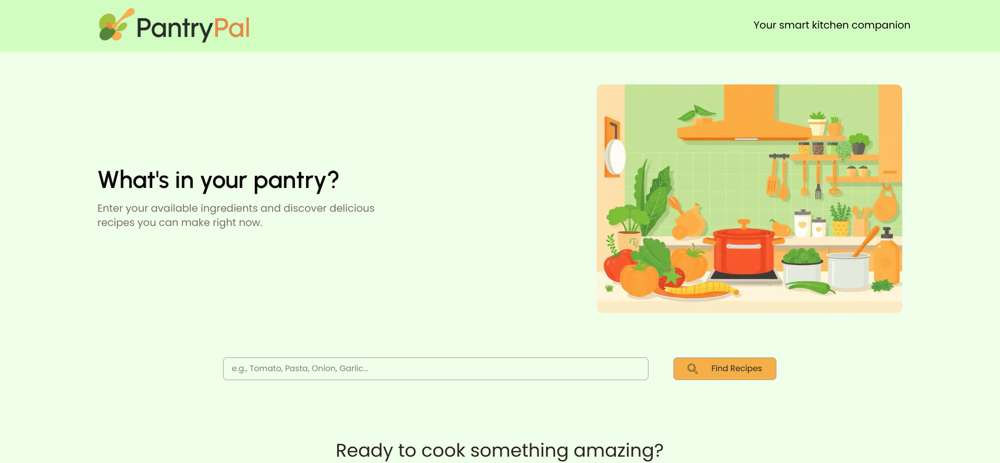
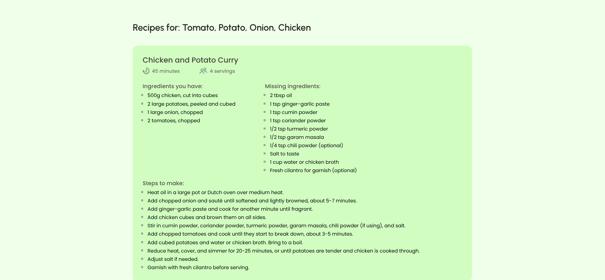

# PantryPal Frontend 🍳

PantryPal is a smart recipe discovery app that helps you find dishes you can cook with the ingredients you already have.  
This repository contains the **frontend code**, built with **React + Vite**.

The frontend connects with the [PantryPal backend](https://github.com/rishikantchoudhary/PantryPal-backend) (Node.js + Express + Gemini AI) to fetch AI-generated recipes in a clean and structured format.

---

## 🚀 Features

- Clean and responsive UI built with **React + TailwindCSS**
- Ingredient input form with **instant navigation** to recipe results
- Loading animation while waiting for backend response
- AI-powered recipe recommendations using **Google Gemini API**
- Recipes displayed as individual **cards** with:
  - ✅ Recipe name
  - ✅ Servings
  - ✅ Estimated cooking time
  - ✅ Ingredients you already have
  - ✅ Missing ingredients
  - ✅ Step-by-step cooking instructions

---

## 🛠️ Tech Stack

- **React + Vite** – frontend framework
- **TailwindCSS** – styling
- **React Router** – navigation
- **Fetch API** – backend communication

---

## 📂 Project Structure

```
pantrypal-frontend/
│
├── public/ # Static assets
├── src/ # React source code
│ ├── assets/ # Images & icons
│ ├── components/ # Reusable UI components
│ ├── pages/ # Page-level components (Home, Recipes, etc.)
│ ├── App.jsx # Main app entry with routes
│ └── main.jsx # React DOM render
│
├── .gitignore
├── index.html
├── package.json
├── vite.config.js
└── README.md
```

---

## ⚡ Getting Started

### 1. Clone the repository

```bash
git clone https://github.com/rishikantchoudhary/PantryPal.git
cd PantryPal
```

### 2. Install dependencies

```bash
npm install
```

### 3. Run locally

```bash
npm run dev
```

This starts a local dev server at http://localhost:5173.

---

## 🔗 Backend Setup

The PantryPal backend is **already deployed and running** 🚀

- Base URL: `https://pantrypal-backend-46sv.onrender.com/`
- Working endpoint: `https://pantrypal-backend-46sv.onrender.com/recipes`

This endpoint is **already configured in the frontend code**, so you don’t need to change anything.  
As soon as the backend is live, the frontend will automatically fetch recipe data.

---

## 📸 Screenshots

### Home Page

Input ingredients and search for recipes


### Recipes Page

AI-powered recipes displayed in structured cards


---

## 👨‍💻 Author

Built with ❤️ by [Rishkant](https://github.com/rishikantchoudhary)
